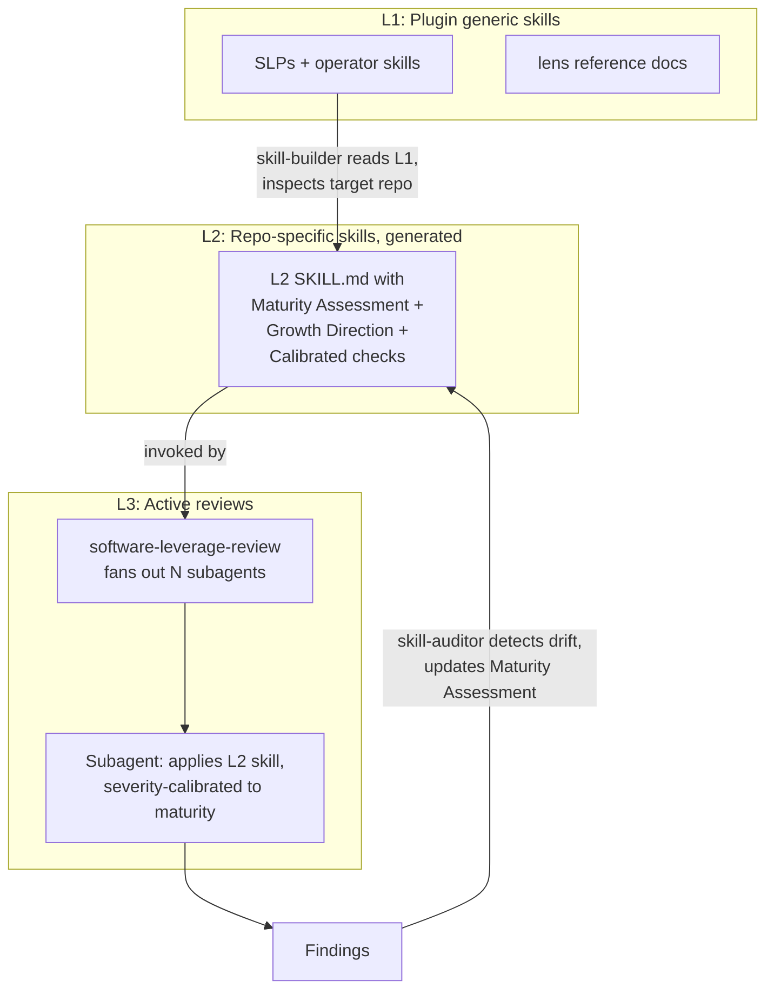

# software-leverage-points

A Claude Code plugin that ships a library of skills for reviewing software through high-leverage lenses: testing, logging, architecture, dependencies, security, configuration, types, documentation, and more. Each lens is its own skill, and an orchestrator (`software-leverage-review`) fans out parallel subagents (one per lens) to review a plan, a PR, or a whole codebase.

## Mental model: a mixture of experts on software design

Most software-quality reviews are single-pass: one agent reads a plan or a diff and tries to weigh every concern at once. That is where issues slip through. Cross-cutting concerns (DRY, complexity, separation of scope) get washed out by domain ones (a missing test, an over-mocked integration, an unpinned dependency).

This plugin treats each high-leverage concern as its own meta-skill, so an autonomous agent can invoke a *committee of experts* in parallel and synthesize the findings:

- **Plan-time gate.** Before implementation begins, fan out the lenses against the plan document. Each lens flags issues from its perspective. The author either revises the plan or proceeds with the issues acknowledged.
- **PR-time gate.** After implementation, fan out against the diff. Each lens flags issues that should block, warn, or inform.
- **Codebase audit.** Run periodically against the whole repo to surface drift and accumulated debt.

The skills compose with [obra/superpowers](https://github.com/obra/superpowers), a sibling plugin that provides the cross-cutting workflow skills (`brainstorming`, `subagent-driven-development`, `writing-plans`, etc.). This plugin focuses purely on the *what to review*; superpowers provides the *how to dispatch and review*.

### L1 to L2 to L3 flow

The plugin separates generic principles (L1) from repo-specific calibration (L2) from active reviews (L3). `skill-builder` is the bridge that reads L1 and inspects the target to produce L2; `software-leverage-review` runs L3 by fanning subagents against L2; `skill-auditor` watches L2 for drift and feeds updates back.



## Credit

Multi-vendor scaffolding patterns adapted from [obra/superpowers](https://github.com/obra/superpowers). We track superpowers as a git `upstream` remote so we can selectively pull scaffolding improvements over time. Skills, agents, and commands are entirely our own.

## Compatibility

This plugin has been developed against `obra/superpowers` at HEAD as of 2026-04-27. The two plugins compose at runtime via vendor-native plugin discovery; no version pin is enforced today. If superpowers introduces breaking changes to its scaffolding conventions, this plugin's `upstream` git remote (pinned to `obra/superpowers`) makes selectively merging only the scaffolding changes straightforward. Skill compatibility is informal: this plugin invokes `superpowers:brainstorming`, `superpowers:writing-plans`, `superpowers:subagent-driven-development`, and `superpowers:writing-skills` by name. Breaking changes to those skills' descriptions or interfaces will require this plugin's docs to be updated.

## Install

This README is the explanation layer: mental model, rationale, and install instructions. The reference inventory of all shipped skills lives in `docs/leverage-points.md`. How-to guides for individual skills live in each skill's own `SKILL.md`. The split follows Diátaxis (explanation, how-to, reference) so each document has one job.

This plugin composes with [`obra/superpowers`](https://github.com/obra/superpowers); install both for the full workflow.

### Claude Code

**From GitHub (marketplace):**

```bash
claude plugin marketplace add syntropic137/software-leverage-points && claude plugin install software-leverage-points
```

**From local clone (development):**

```bash
claude plugin install /absolute/path/to/software-leverage-points --scope project
```

See [`docs/local-testing.md`](docs/local-testing.md) for the full local-development loop (persistent install, ephemeral install, `/reload-plugins`).

### Other vendors

- Codex: [`docs/README.codex.md`](docs/README.codex.md)
- OpenCode: [`docs/README.opencode.md`](docs/README.opencode.md)
- Cursor: `.cursor-plugin/plugin.json` describes the plugin to Cursor's plugin loader
- Gemini: `gemini-extension.json` registers the extension

### Updating

```bash
claude plugin marketplace update software-leverage-points
claude plugin update software-leverage-points@syntropic137
```

Refreshing the marketplace catalog before the plugin update ensures the cache has the latest release before the install runs.

## Skills

The shipped skills are leverage-point skills, operator skills, and lens reference docs. Detailed status and file paths live in `docs/leverage-points.md`. When invoked through a vendor's plugin discovery, skills are namespaced (e.g., `/software-leverage-points:testing`).

### Leverage-point skills

Each leverage-point skill reviews a codebase, plan, or PR through one high-leverage lens. The list below is auto-generated; for the canonical reference doc with status flags and lens references, see `docs/leverage-points.md`.

<!-- begin:readme-slp-catalog -->
- **[architecture](skills/architecture/SKILL.md)**: Use when reviewing architectural concerns: module boundaries, dependency direction, layer discipline, bounded-context isolation, ADR coverage, premature abstraction, and structural fitness for change
- **[configuration](skills/configuration/SKILL.md)**: Use when reviewing configuration concerns: env-var layering, typed config objects, startup validation, secret/non-secret separation, schema discoverability, environment-dependent defaults, twelve-factor compliance, magic numbers
- **[continuous-delivery](skills/continuous-delivery/SKILL.md)**: Use when reviewing delivery concerns: DORA four key metrics, pre-merge gating, trunk-based development, fast feedback, single-artifact promotion, health-gated deploys, automated rollback, deploy/release decoupling via feature flags, deploy frequency, runbook freshness, deploy-credential scoping, pipeline bottleneck visibility, supply-chain attestation
- **[dependencies](skills/dependencies/SKILL.md)**: Use when reviewing dependency concerns: lockfile health, version pinning, immutable references, maintenance signals, transitive audit gates, monorepo version skew, reviewable lockfiles, license posture
- **[developer-experience](skills/developer-experience/SKILL.md)**: Use when reviewing developer-experience concerns: single-command onboarding (contributors and end-users), inner-loop speed, task-runner discoverability, recipe-as-thin-wrapper discipline, error-message actionability, formatter/linter automation, AI-agent ergonomics, reproducible local environment, parallel-worktree dev stacks
- **[documentation](skills/documentation/SKILL.md)**: Use when reviewing documentation concerns: README presence and quality, public API documentation, ADR coverage for non-obvious decisions, inline rationale comments, TBD/placeholder hygiene in shipped docs
- **[dry](skills/dry/SKILL.md)**: Use when reviewing DRY concerns: knowledge-vs-text duplication, repeated business rules across boundaries, magic constants, configuration duplication, copy-pasted test fixtures, premature abstraction risk, rule-of-three for extraction
- **[environments](skills/environments/SKILL.md)**: Use when reviewing environment concerns: dev/staging/prod parity, declarative environment manifests, build vs runtime separation, environment promotion path, secret-loader parity across environments, reproducible local setup, ephemeral / preview environments per PR with auto-teardown, data parity (shape-realistic seed and anonymized prod copies), mechanically enforced parity rules
- **[error-handling](skills/error-handling/SKILL.md)**: Use when reviewing error-handling concerns: error taxonomy, propagation discipline, swallow-vs-crash, retry semantics with backoff and idempotency, exit codes as API, error messages as contract, cause-chain preservation
- **[logging](skills/logging/SKILL.md)**: Use when reviewing logging concerns: structured-vs-unstructured logs, log-level policy, secret and PII redaction, correlation IDs in distributed systems, log/trace linkage, print statements in production code paths
- **[principles-and-patterns](skills/principles-and-patterns/SKILL.md)**: Use when reviewing cross-cutting design principles: SOLID applicability, separation of concerns, dependency direction, composition vs inheritance, coupling and cohesion, OO-vs-functional style consistency, pattern enforcement style, project-level bounded-context coupling
- **[purpose-and-scope](skills/purpose-and-scope/SKILL.md)**: Use when reviewing purpose-and-scope concerns: stated project purpose, declared in-scope and out-of-scope, non-goals, plan-purpose alignment, scope-creep within a single change, project-level bounded contexts, dependency-purpose linkage
- **[security](skills/security/SKILL.md)**: Use when reviewing security concerns: secrets in code, SAST coverage, input validation, authn/authz boundaries, sensitive-data handling, dependency CVEs, SSRF, hand-rolled escaping, threat modeling for high-stakes changes, defense in depth, agentic-AI / LLM tool-call attack surface (prompt injection, indirect injection, MCP abuse)
- **[software-complexity](skills/software-complexity/SKILL.md)**: Use when reviewing software complexity concerns: cognitive load, cyclomatic and cognitive complexity bounds, deep-vs-shallow modules, accidental coupling, premature abstraction, asymmetric simplicity, comments-explain-why
- **[testing](skills/testing/SKILL.md)**: Use when reviewing testing concerns: pyramid coverage (unit, integration, E2E), test code quality, TDD discipline, regression discipline, FIRST principles, feedback-loop speed
- **[types](skills/types/SKILL.md)**: Use when reviewing type-system concerns: type-coverage in public APIs, primitive obsession vs refinement, runtime validation at trust boundaries, soundness gaps and escape hatches, narrow vs wide types, strict-mode discipline
- **[versioning](skills/versioning/SKILL.md)**: Use when reviewing versioning concerns: declared scheme (semver/calver/ZeroVer), changelog hygiene, deprecation policy and migration paths, public-API stability classification, version-bump automation, manifest-drift across multiple files, release process (cut-a-release flow, release branches, release gates)
<!-- end:readme-slp-catalog -->

### Layers

- **L1 (meta-skills):** generic skills that ship in this plugin. Repo-agnostic.
- **L2 (repo skills):** skills that `skill-builder` generates inside a target repo's `.claude/skills/`, customized for that repo's stack and conventions.
- **L3 (active reviews):** the orchestrator's runtime: parallel subagents reviewing a target through every lens.

## Authoring style

Each leverage-point skill is more than a checklist. It cites the canonical references for the concern (books, ADR patterns, named thinkers) and explains *why* each red flag matters. The intent is for an agent reading the skill to operate with the same reasoning a senior engineer would, not just pattern-match.

Examples:
- The `testing` skill cites Beck (Test-Driven Development), Khorikov (Unit Testing Principles), and surfaces the integration-vs-mock discipline distinction.
- The `architecture` skill cites Brooks (No Silver Bullet), Fowler (Patterns of Enterprise Application Architecture), and asks for ADRs.
- The `types` skill cites Hejlsberg, Ousterhout (A Philosophy of Software Design), and asks how the type system is being used as documentation.

## Local development

```bash
git clone https://github.com/syntropic137/software-leverage-points
cd software-leverage-points
claude plugin install $(pwd) --scope project
```

See [`docs/local-testing.md`](docs/local-testing.md) for the full development loop.

## Project rules

See `CLAUDE.md` for the rules contributors and agents should follow when editing this plugin.

## License

MIT. See `LICENSE`. Scaffolding patterns adapted from `obra/superpowers` (also MIT).
